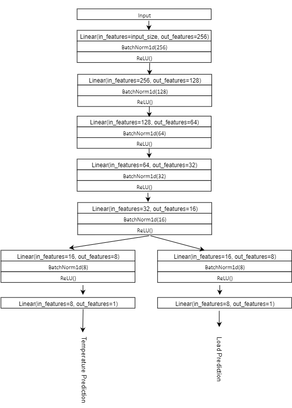
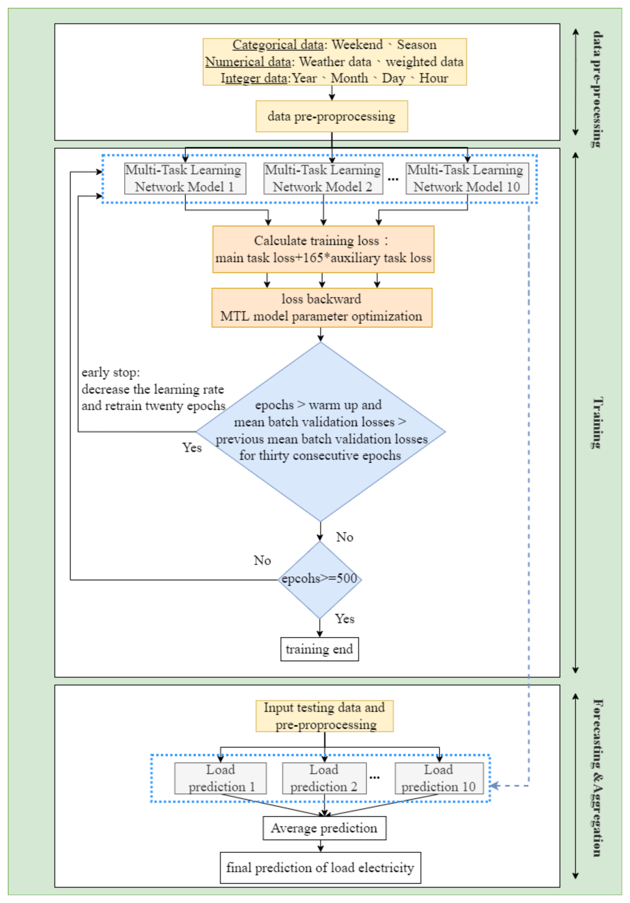

# Multi-Task-Learning-Model
* This work can be found in  [[Energy and Buildings]](https://www.sciencedirect.com/science/article/abs/pii/S0378778822007721).
  
📍 We perform data exploration on the training set and the results show that the electricity load is relevant to the temperature. Thus, in our proposed architecture, the main task is to predict the electricity load, while the auxiliary task is to predict the temperature.

📍 The auxiliary task can provide additional regularization to the model to prevent overfitting.

📍 The proposed model aims to use the auxiliary task as a regularization to help the model learn discriminative representations for the task-shared layers.

# Model Structure

📍 The task-shared layers in the proposed model comprise five fully-connected layers, while the task-specific layers consist of two fully-connected layers.

📍 Note that the data source in this work belongs to the tabular format in which the data samples are presented in a table with rows and columns rather than complex data formats such as images, texts, or signals. Therefore, we only use fully-connected layers without using convolutional layers in the developed model.

📍 The main task is to predict the load of the next hour, while the auxiliary task is to predict the temperature of the next hour.

# :open_file_folder: Model Training
## Sensitivity analysis of the weight c
* An MTL model involves two or more tasks, so the final loss function is the aggregation of the task losses. In our proposed model, these two tasks are apparently different, as the value of temperature is quite lower than that of the electricity load.

* we combine the two loss functions with a hyperparameter c. We use a simple heuristic to determine the value of c using the ratio between the average load and the average temperature of the training set.

## Dataset
📍 This work uses a real-world dataset to conduct experiments, in which the dataset comprises electricity load data and weather data. Daily electricity load data was collected hourly from a commercial building in Taipei, Taiwan, from January 1, 2019, to April 30, 2021. 

📍 Weather data comprises hourly weather information for each electricity load data sample, including air pressure, humidity, wind speed, rainfall, and temperature.

## Experimental Settings
  

In experiments, the size of the input window T is 24, and we use different forecasting horizon values m to perform experiments, in which m ∈ {3,6,12,24}.

## Comparison Methods
Comparison methods involve machine learning, deep learning, and statistical methods. We use machine learning methods that are commonly used in previous work as comparison methods.

* Comparison Methods
* Autoregressive integrated moving average (ARIMA) 
* Decision Tree 
* Random Forest (RF) 
* XGBoost
* NeuralProphet 
* Support Vector Regression (SVR)

  

## Ensemble Learning
📍 One key idea behind ensemble
learning is to combine various base models to boost model performance.

📍 In the experiments, we use a simple ensemble approach by training ten models, each of which has differentinitial weights due to randomness. Subsequently, we use the average of the predictions as the prediction outcomes.

# 📚 Experimental Results
📍 The proposed model can provide stable performance as the forecast horizon increases.
  

📍 We conclude the reasons that our proposed model can outperform the other comparison methods as follows. 

 

📍 It is worth mentioning that the ensemble of our proposed MTL model can yield the best performance.

